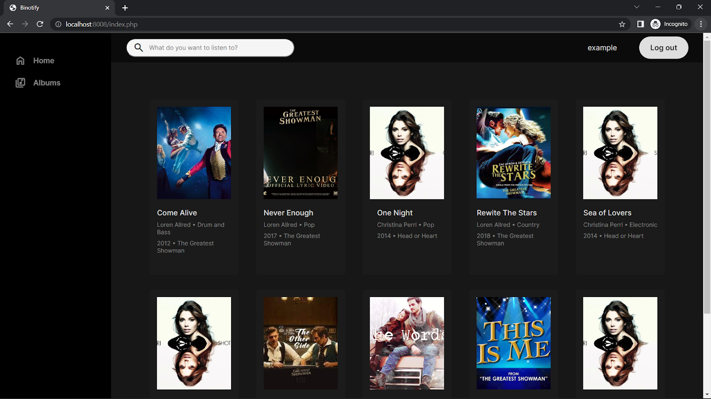

Binotify
=========================================================

#### Table of Contents
- [About](#about)
- [Getting Started](#getting-started)
   - [Prerequisites](#prerequisites)
   - [Creating docker image](#creating-docker-image)
   - [Composing](#composing)
- [Usage](#usage)
- [Demo](#demo)
- [Contributors](#contributors)

## About
Binotify is a simple website for online music streaming. It is built on top
of LAMP (Linux-Apache-MySQL-PHP) and is self-contained using Docker. The website
consists of basic functionalities you could find in various online music
streaming services. It can list recently added songs in its homepage; search
for musics based on title, artist, and published year; play music using
customized audio player; and many more. Binotify also supports authentication
because of which users can sign up and log in to the site. It also provides
admin functionalities, such as adding new songs, adding new albums, modifying
existing song or album data, which can only be done using admin account.
This project is made to fulfill
`Tugas Besar 1 IF3110 Pengembangan Aplikasi Berbasis Web`.

## Getting Started

### Prerequisites

You will need [Docker](https://www.docker.com/) to containerize the web server.

### Creating docker image

To create a docker image for the web server, simply run

```shell
docker build -t tubes-1:latest .
```

in the terminal or run the shell script `./scripts/build-image.sh`.

```shell
sh ./scripts/build-image.sh
```

### Composing

After creating the image compose the image with `mysql` image using

```shell
docker compose up
```

or run

```shell
sh ./scripts/compose.sh
```

## Usage

With the setup done, the port `8008` will now be open to serve requests to
the website. You can open the website locally by accessing `localhost:8008`.
By opening the URL on the browser, you will be greeted with a homepage containing
navigation sidebar, header, and main section which consists of up to 10 most
recent song added. From the homepage, as an unauthenticated user, you may
go to album list page or search for a song you want to listen to. You can also
sign up or log in by clicking one of the buttons on the right of the header.
The rest of the site is pretty much self-explanatory.

## Demo

These are some screen captures of Binotify UI on various pages.
1. Failed to log in

2. Failed to sign up

3. Usable credential validation

4. Homepage as unauthenticated user

5. Homepage as logged-in user

6. Homepage as admin
   
7. Album list page

8. Listen page as user

9. Listen page as admin
   
10. Editing music

11. Successfully edited music
    
12. Failed to edit music

13. Listening to music

14. Album detail page as user

15. Album detail page as admin

16. Editing album

17. Successfully edited album

18. Failed to edit album

19. Failed to delete album

20. Successfully deleted music

21. Successfully added new music

22. Failed to add new music

23. Successfully added new album

24. Failed to add new album

25. Search page

26. Filtering search result by genre

27. Sorting search result by published year

28. Search result pagination

29. Users list page


## Contributors

Here are the list of contributors by functionalities worked on.

| Feature           | Server-side                  | Client-side                  |
|-------------------|------------------------------|------------------------------|
| Login             | 13520112                     | 13520112                     |
| Register          | 13520112                     | 13520112                     |
| Tambah lagu       | 13520112                     | 13520112                     |
| Hapus lagu        | 13520063, 13520112, 13520166 | 13520063, 13520112, 13520166 |
| Lihat detail lagu | 13520166                     | 13520063, 13520112, 13520166 |
| Ubah detail lagu  | 13520112                     | 13520063, 13520112, 13520166 |
| Dengar lagu       | 13520166                     | 13520063, 13520112, 13520166 |
| Search lagu       | 13520166                     | 13520166                     |
| Sort lagu         | 13520166                     | 13520166                     |
| Filter lagu       | 13520166                     | 13520166                     |
| Tambah album      | 13520063                     | 13520063                     |
| Edit album        | 13520063, 13520112, 13520166 | 13520063                     |
| Hapus album       | 13520063, 13520112, 13520166 | 13520063                     |